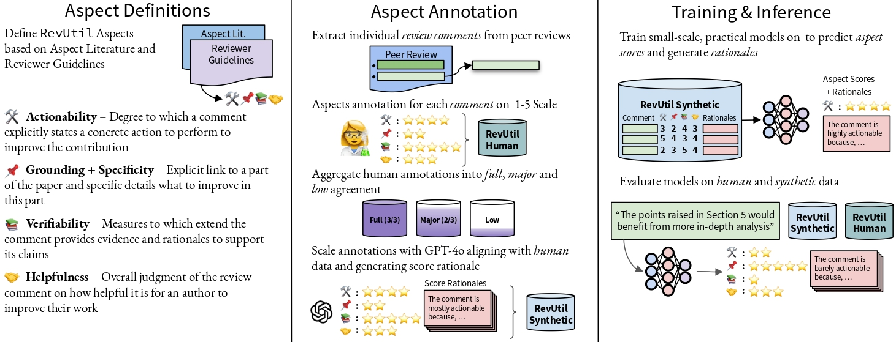

# The Good, the Bad and the Constructive: Automatically Measuring Peer Review's Utility for Authors

---

<p align="center">
  <a href=""></a>
  <a href="https://huggingface.co/datasets/boda/RevUtil_human"></a>
  <a href="https://huggingface.co/datasets/boda/RevUtil_synthetic"></a>
  <a href="https://github.com/bodasadallah/review_rewrite/blob/main/LICENSE"></a>

</p>

### :fire: News

- [21-08-2025] Our paper got accepted to the **Main conference of EMNLP**.
<!---
-->

## 📝 Abstract

> Providing constructive feedback to paper authors is a core component of peer review. With reviewers increasingly having less time to perform reviews, automated support systems are required to ensure high reviewing quality, thus making the feedback in reviews useful for authors.
>
> To this end, we identify four key aspects of review comments (individual points in weakness sections of reviews) that drive their utility for authors: **Actionability**, **Grounding & Specificity**, **Verifiability**, and **Helpfulness**.
>
> To support evaluation and model development, we introduce the **RevUtil** dataset, consisting of 1,430 human-labeled review comments and 10,000 synthetically labeled comments (with rationales) for training.
>
> Using this dataset, we benchmark fine-tuned models for scoring and explaining review comments. These models achieve agreement with human annotations on par with, or even exceeding, GPT-4o. Further analysis shows that GPT-4-generated reviews generally underperform human reviews on these utility dimensions.

---

## 🖼️ System Overview



---

## 📚 Dataset

### 🧑‍🔬 RevUtil Human

 [`boda/RevUtil_human`](https://huggingface.co/datasets/boda/RevUtil_human)

The dataset contains **1,430** review comments annotated by three human raters.

**Key columns:**

| Column              | Description                                                                 |
| ------------------- | --------------------------------------------------------------------------- |
| `paper_id`          | ID of the reviewed paper                                                    |
| `venue`             | Conference or journal name                                                  |
| `focused_review`    | Full review (weakness + suggestion sections)                                |
| `review_point`      | Individual review comment being evaluated                                   |
| `id`                | Unique ID for the review point                                              |
| `batch`             | Identifier for the annotation batch/study                                   |
| `ASPECT`            | Dictionary with `annotators` and their individual labels                    |
| `ASPECT_label`      | Majority label (empty if no agreement among annotators)                     |
| `ASPECT_label_type` | Label quality: `"gold"` (3/3), `"silver"` (2/3), or `"None"` (no agreement) |

---

### 🤖 RevUtil Synthetic

 [`boda/RevUtil_synthetic`](https://huggingface.co/datasets/boda/RevUtil_synthetic)  
Synthetic dataset generated using **GPT-4o** with 10k examples (9k train / 1k test).

**Key columns:**

| Column                     | Description                                  |
| -------------------------- | -------------------------------------------- |
| `paper_id`                 | ID of the reviewed paper                     |
| `venue`                    | Conference or journal name                   |
| `focused_review`           | Full review (weakness + suggestion sections) |
| `review_point`             | Individual review comment                    |
| `id`                       | Unique ID for the review point               |
| `chatgpt_ASPECT_score`     | Model-generated score for the aspect         |
| `chatgpt_ASPECT_rationale` | Explanation of the score provided by GPT-4o  |

---

## 🛠️ Finetuning

We use the [Hugging Face Alignment Handbook](https://github.com/huggingface/alignment-handbook) for training scripts. We apply **LoRA-based** fine-tuning and leverage **DeepSpeed ZeRO** for distributed training.

### 🏃 To start finetuning

```bash
bash finetune.sh
```

### 🔧 Important configuration options (in `finetune.sh`)

| Variable          | Description                                                    |
| ----------------- | -------------------------------------------------------------- |
| `USE_PEFT=true`   | Enables LoRA training instead of full fine-tuning              |
| `GENERATION_TYPE` | `"score_only"` or `"score_rationale"` for rationale generation |
| `ASPECTS=("all")` | Choose `"all"` or specific aspects like `"actionability"`      |

---

## ✅ Evaluation

All evaluation scripts are in the `inference/` directory and use [vLLM](https://github.com/vllm-project/vllm).

### 🏃 To run evaluation

```bash
bash inf.bash
```

### 🔧 Important configuration options (in `inf.bash`)

| Variable           | Description                                                |
| ------------------ | ---------------------------------------------------------- |
| `FINETUNING_TYPE`  | `"adapters"` for LoRA models, `"baseline"` for base models |
| `STEP`             | Checkpoint to evaluate (`0` for latest or for base models) |
| `TRAINING_aspects` | Aspects the model was trained on (e.g., `"all"`)           |
| `GENERATION_TYPES` | `"score_only"` or `"score_rationale"`                      |

---

### 🗃 Dataset Configurations

```bash
DATASETS=("boda/RevUtil_human" "boda/RevUtil_synthetic")
DATASET_SPLITS=("full" "test")
DATASET_CONFIGS=("combined_main_aspects" "all")
```

---

## 📊 Analysis

All scripts and notebooks for performance breakdown and visualization are included in the `analysis/` directory.

---

## 📎 Citation

_Coming soon after publication!_

## License

RevUtil is licensed under a
[Creative Commons Attribution-NonCommercial-ShareAlike 4.0 International License](http://creativecommons.org/licenses/by-nc-sa/4.0/).

## Contact

For questions or contributions, contact:

- Abdelrahman Sadallah (abdelrahman.sadallah@mbzuai.ac.ae)
- Tim Baumgärtner (baumgaertner.t@gmail.com)
